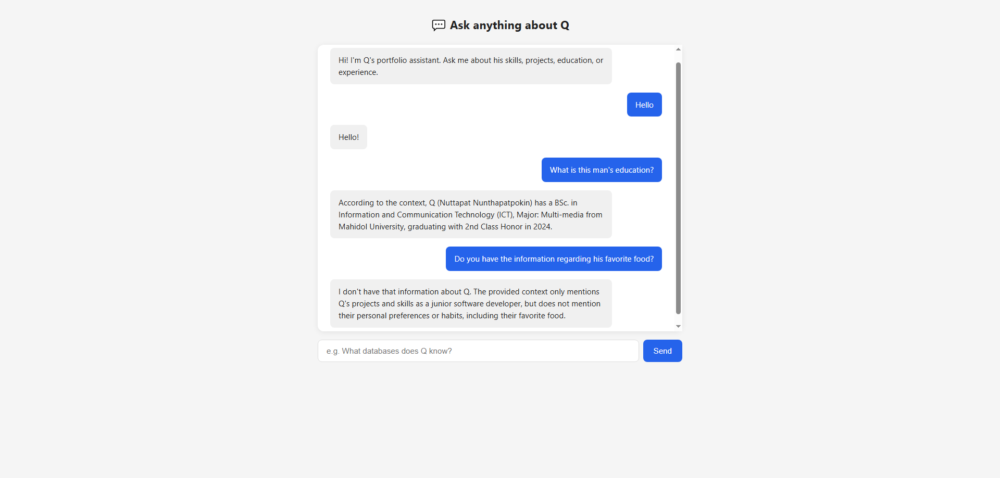

# RAG Chatbot — Portfolio Project

A chatbot that answers questions about me (Q) using Retrieval-Augmented Generation.
Ask it about my skills, projects, experience, or education — it retrieves the relevant
parts of my resume and lets the LLM form a grounded answer. Zero hallucination by design.

Built as a portfolio project to demonstrate RAG architecture, LLM provider abstraction,
and production-grade containerization.



---

## What is RAG?

A plain LLM makes things up when it doesn't know something. RAG fixes this by giving
the LLM only the relevant facts it needs to answer a specific question — retrieved
from a real document at query time.

```
Query flow:
  Question → Chroma (vector search) → Top 3 relevant chunks → LLM prompt → Answer

Ingestion flow:
  .txt documents → chunk (size=1000, overlap=100) → embed (all-MiniLM-L6-v2) → Chroma
```

The LLM never sees the full document. It only sees the chunks most relevant to the
question, plus an instruction: "Answer only from this context." If the answer isn't
there, it says so.

---

## Tech Stack

| Tool | Role | Why |
|---|---|---|
| **FastAPI** | Web server + API | Async, type-safe, auto docs — production standard for Python APIs |
| **LangChain** | RAG orchestration | Abstracts document loading, splitting, retrieval chains |
| **ChromaDB** | Vector store | Embedded, no separate server, persists to disk via Docker volume |
| **sentence-transformers** | Embeddings | Runs locally, no API cost, `all-MiniLM-L6-v2` is fast and accurate |
| **Ollama** | Local LLM server | Free, runs llama3 on CPU, no API key needed for dev |
| **Anthropic API** | Production LLM | Switched in via env var, no code changes required |
| **Docker + Compose** | Containerization | One-command startup, reproducible environment, volume persistence |
| **GitHub Actions** | CI/CD | Lints and pushes Docker image to Docker Hub on every merge to main |

---

## Architecture

```
┌─────────────────────────────────────────────────────┐
│                   docker-compose                    │
│                                                     │
│  ┌──────────────────┐      ┌──────────────────────┐ │
│  │    rag-app       │      │     rag-ollama       │ │
│  │                  │      │                      │ │
│  │  FastAPI :8000   │─────>│  Ollama :11434       │ │
│  │  LangChain RAG   │      │  llama3 model        │ │
│  │  ChromaDB        │      └──────────────────────┘ │
│  │  HF Embeddings   │                               │
│  └──────────────────┘                               │
│         │                                           │
│    ┌────┴──────────────────┐                        │
│    │  chroma-data volume   │  ← vectorstore         │
│    │  hf-cache volume      │  ← embedding model     │
│    │  ollama-data volume   │  ← llama3 weights      │
│    └───────────────────────┘                        │
└─────────────────────────────────────────────────────┘
```

---

## Run Locally (Ollama)

**Prerequisites:** Python 3.13, [Ollama](https://ollama.com) installed and running

```bash
# 1. Clone the repo
git clone https://github.com/IK-MEE/RAG-AI-study-project.git
cd rag-chatbot

# 2. Pull the model
ollama pull llama3

# 3. Install dependencies
pip install -r requirements.txt

# 4. Copy environment file
cp .env.example .env

# 5. Build the vectorstore
python test_rag.py

# 6. Start the server
uvicorn app.main:app --reload
```

Open `http://localhost:8000` and start asking questions.

---

## Run with Docker

**Prerequisites:** Docker Desktop running, local Ollama stopped (port conflict on 11434)

```bash
# 1. Clone the repo
git clone https://github.com/IK-MEE/RAG-AI-study-project.git
cd rag-chatbot

# 2. Start the full stack
docker compose up --build

# 3. Pull the model into the Ollama container (first time only)
docker exec rag-ollama ollama pull llama3
```

Open `http://localhost:8000`. The vectorstore builds automatically on first run.
All data persists across restarts via named Docker volumes.

---

## Switch to Anthropic API

No code changes required. Edit `.env`:

```env
LLM_PROVIDER=anthropic
ANTHROPIC_API_KEY=your-key-here
```

Restart the server. The factory function in `app/llm.py` handles the rest.

For Docker, update the `environment` section in `docker-compose.yml` accordingly.

---

## Key Engineering Decisions

**Provider abstraction pattern (`app/llm.py`)**
A single `get_llm()` factory function returns either `ChatOllama` or `ChatAnthropic`
based on the `LLM_PROVIDER` environment variable. The RAG chain never knows which
provider it received — it just calls `.invoke()`. Switching providers in production
is a one-line config change with zero code changes. This is the Open/Closed Principle
in practice.

**Singleton RAG chain at startup (`app/main.py`)**
The retriever and LLM client are built once when the server starts, not on every
request. Loading the vectorstore and instantiating the LLM client on every HTTP call
would add 2–5 seconds of latency per request. Singleton pattern keeps response time
proportional to LLM inference time only.

**Entrypoint auto-initialization (`entrypoint.sh`)**
On container startup, the entrypoint checks whether `chroma.sqlite3` exists in the
volume. If not, it runs the ingestion pipeline before starting uvicorn. This makes
`docker compose up` a true one-command startup — no manual vectorstore building,
no separate init container, no race conditions.

**Three named Docker volumes**
`chroma-data` persists the vectorstore, `hf-cache` persists the embedding model,
`ollama-data` persists the llama3 weights. Without these, every `docker compose up`
would re-download the embedding model (~90MB) and rebuild the vectorstore from scratch.
Named volumes survive container restarts and `docker compose down`.

**Non-root container user**
The app runs as `appuser` inside the container. Combined with `HF_HOME` redirected
to `/app/.cache/huggingface` (a path `appuser` owns), this avoids both privilege
escalation risk and the permission errors that occur when HuggingFace tries to write
to `/root/.cache`.

**Prose over JSON for source documents**
The resume data was available as structured JSON. It was converted to natural prose
before ingestion because embedding models are trained on human-readable text. JSON
keys, colons, and braces add noise that degrades retrieval accuracy. Prose embeds
more distinctly per section, producing better chunk separation in vector space.

**Chunk size tuned for structured documents**
`chunk_size=1000, chunk_overlap=100` was chosen after testing at `chunk_size=500`.
At 500, resume sections (SKILLS, EDUCATION, EXPERIENCE) were fragmented across
multiple chunks with near-identical embeddings, causing all queries to return the
same chunks regardless of topic. At 1000, each section fits in one chunk with a
distinct embedding — skills queries return the skills chunk, education queries return
the education chunk.

---

## CI/CD

Every push to `main` triggers the GitHub Actions pipeline:

1. Install dependencies
2. Lint with `ruff`
3. Build Docker image
4. Push to Docker Hub as `username/rag-chatbot:latest`

Requires `DOCKERHUB_USERNAME` and `DOCKERHUB_TOKEN` secrets in GitHub repo settings.

---

## Future Improvements

- **Cloud deployment** — Railway or Render with a persistent volume for ChromaDB,
  enabling a live demo link on the portfolio
- **Chat history** — `app/chat.py` is scaffolded but empty; adding conversation
  memory would let the LLM answer follow-up questions like "tell me more about that"
- **pgvector** — swap ChromaDB for PostgreSQL + pgvector for teams already running
  Postgres in production; eliminates a separate vector store dependency
- **Streaming responses** — FastAPI supports `StreamingResponse`; piping LLM token
  output directly to the browser would eliminate the "Thinking..." wait
- **Re-ingestion endpoint** — a `POST /ingest` endpoint that rebuilds the vectorstore
  from updated documents without restarting the container

---

## Author

**Nuttapat Nunthapatpokin (Q)**
Bang Phli, Samutprakarn, Thailand
[github.com/IK-MEE](https://github.com/IK-MEE) · ikewmee@gmail.com
